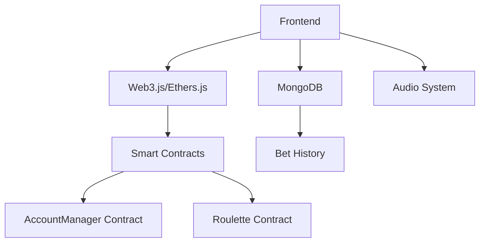

# Ethereum Roulette Game

A decentralized roulette game built on Ethereum using Hardhat, with a modern web frontend and smart contract backend.

## Project Architecture



## Technical Stack

### Frontend
- HTML5 + JavaScript (ES6+)
- Web3/Ethers.js for blockchain interaction
- Bootstrap for UI components
- Custom animations and sound effects
- Real-time updates and responsive design

### Backend
- Hardhat development environment
- Solidity smart contracts
- MongoDB for bet history
- Express.js server

### Smart Contracts

#### AccountManager Contract
```solidity
interface IAccountManager {
    function activateAccount() external;
    function deposit() external payable;
    function withdraw(uint256 amount) external;
    function getAccountInfo(address player) external view returns (bool isActive, uint256 balance);
}
```

#### Roulette Contract
```solidity
interface IRoulette {
    function placeBetAndSpin(uint8[] memory choices) external payable;
    function getbetCounter() external view returns (uint256);
    event GameResult(uint8 result, uint256 betAmount, uint256 winAmount, bool isWin);
}
```

## Features

### Game Mechanics
- Single number bets (0-36)
- Special bets (Red/Black, Even/Odd, etc.)
- Multiple betting options
- Real-time wheel animation
- Sound effects and background music

### Wallet Integration
- MetaMask support
- Hardhat local network fallback
- Automatic account activation
- Balance management
- Deposit/Withdrawal functionality

### User Interface
- Interactive betting grid
- Real-time balance updates
- Animated roulette wheel
- Sound controls
- Bet history tracking

## Setup Instructions

### Prerequisites
```bash
# Required software
Node.js v14+
MongoDB
MetaMask browser extension
```

### Installation
```bash
# Clone repository
git clone [repository-url]
cd Roulette-Game

# Install dependencies
npm install

# Configure environment
cp .env.example .env
# Edit .env with your settings
```

### Development Environment
```bash
# Start local blockchain
npx hardhat node

# Deploy contracts
npx hardhat run scripts/deploy.js --network localhost

# Start application
node server.js
```
It should run in http://localhost:3000/

## API Documentation

### Endpoints
```javascript
POST /api/bets
- Save new bet results
- Body: { player, amount, betType, result, win }

GET /api/bets
- Retrieve all bet history
- Query params: { limit, offset }

GET /api/bets/:address
- Get specific user's bet history
- Params: address (player's wallet address)
```

### Database Schema
```javascript
Bet {
    player: Address,
    amount: Number,
    betType: String,
    result: Number,
    win: Boolean,
    timestamp: Date
}
```

## Game Logic Flow

1. **Initialization**
   - Connect wallet (MetaMask/Hardhat)
   - Verify contract deployment
   - Setup event listeners
   - Initialize UI components

2. **Betting Process**
   - Select bet type/number
   - Enter bet amount
   - Verify balance
   - Submit transaction
   - Animate wheel spin
   - Process result
   - Update balance
   - Save to history

3. **Account Management**
   - Automatic activation
   - Deposit functionality
   - Withdrawal system
   - Balance tracking

## Contract Deployment

### Networks
```javascript
const CONTRACT_ADDRESSES = {
    localhost: {
        accountManager: "0x...",
        roulette: "0x..."
    },
    testnet: {
        accountManager: "0x...",
        roulette: "0x..."
    }
};
```

### Deployment Commands
```bash
# Local deployment
npx hardhat run scripts/deploy.js --network localhost

# Testnet deployment
npx hardhat run scripts/deploy.js --network testnet
```

## Testing

```bash
# Run contract tests
npx hardhat test

# Run specific test file
npx hardhat test test/Roulette.test.js

# Run with gas reporting
REPORT_GAS=true npx hardhat test
```

## Security Considerations

- Random number generation security
- Front-running prevention
- Balance management
- Access control
- Gas optimization
- Transaction failure handling

## Contributing

1. Fork the repository
2. Create feature branch
3. Commit changes
4. Push to branch
5. Create Pull Request

## 👨‍💻 Tác giả

**Nguyễn Văn Mạnh**
- 🌐 Website: [https://vanmanh-dev.id.vn/](https://vanmanh-dev.id.vn/)
- 💼 Kỹ sư phần mềm tại TP. Hồ Chí Minh
- 🎯 Chuyên môn: Web Development, Software Engineering

---
Developed with ❤️ by Nguyễn Văn Mạnh
```